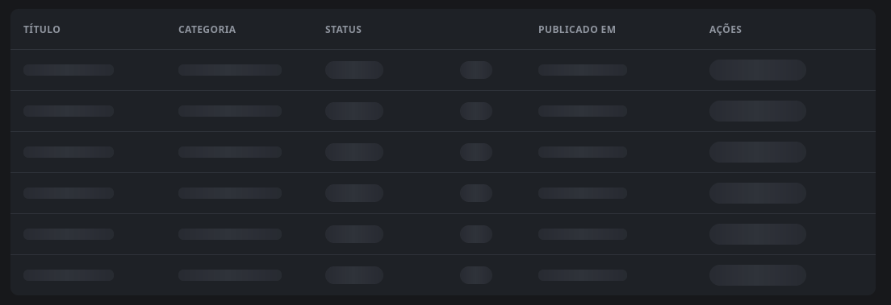
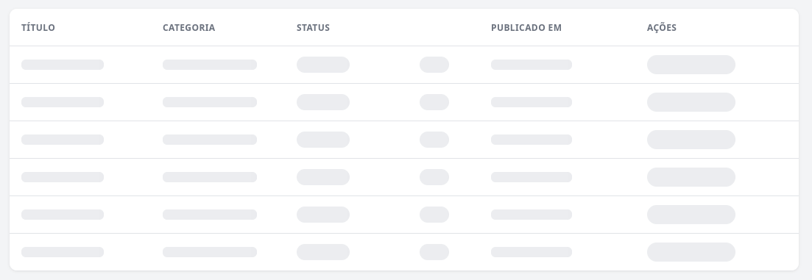
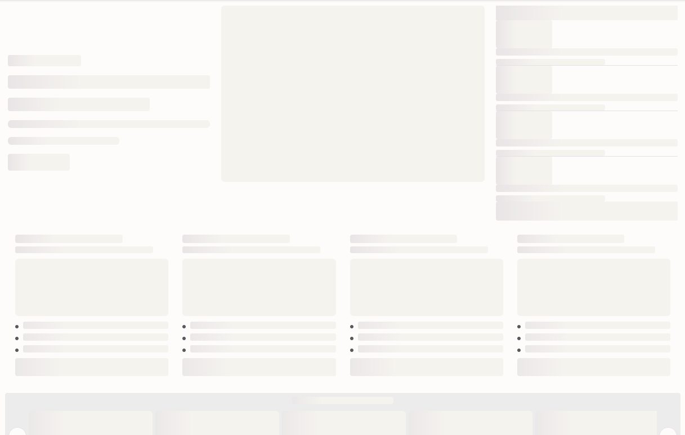
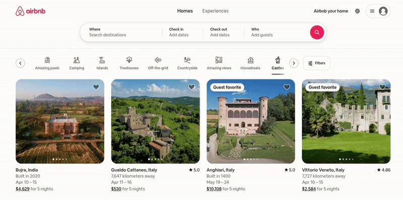

# Skeleton Loading

Referência visual e de arquitetura para placeholders de carregamento no estilo skeleton (blocos cinza/escuros com brilho animado, no formato do conteúdo real), usados no lugar de spinner ou tela em branco durante o carregamento de dados assíncronos.

Baseado na implementação do projeto JM - Jornal de Mirador (`/home/marcos/Documentos/Projects/jm-jornal-de-mirador`) e em referências externas (Airbnb).

## Referências Visuais

### Tabela admin - tema escuro (JM)



### Tabela admin - tema claro (JM)



### Dashboard com cards (JM)



### Referência externa - Airbnb (grid de cards com imagem)



## Ideia Geral

- Skeleton loading substitui spinner genérico ou tela em branco enquanto dados assíncronos carregam, usando blocos no formato exato do conteúdo real (linhas de tabela, cards, linhas de texto, imagem).
- Reduz a percepção de espera e evita "pulo de layout" (layout shift) quando o conteúdo real chega, porque o skeleton já ocupa o mesmo espaço/estrutura.
- Spinner continua reservado para ações pontuais (ex: botão de salvar em loading); skeleton é para carregamento de página/lista/seção inteira.

## Padrão de Implementação (CSS puro, sem lib externa)

Uma única classe utilitária global cuida da cor e da animação; cada componente só define o formato (largura, altura, border-radius) reaproveitando essa classe.

```css
.skeleton-block {
  border-radius: 6px;
  background: linear-gradient(90deg, var(--surface-alt) 25%, var(--border) 50%, var(--surface-alt) 75%);
  background-size: 200% 100%;
  animation: skeleton-shimmer 1.4s ease-in-out infinite;
}

@keyframes skeleton-shimmer {
  0% { background-position: 200% 0; }
  100% { background-position: -200% 0; }
}

@media (prefers-reduced-motion: reduce) {
  .skeleton-block {
    animation: none;
  }
}
```

- A animação é um "shimmer" (gradiente varrendo da direita para a esquerda), não um simples pulso de opacidade.
- **Nunca redeclarar** o `@keyframes`/gradiente em CSS de componente — todo skeleton do sistema reaproveita essa única classe para cor+animação, e só adiciona uma classe própria para tamanho/formato.
- Tema claro/escuro é resolvido automaticamente porque a cor vem de variáveis CSS (`--surface-alt`, `--border`) que já mudam de valor conforme o tema ativo — não duplicar CSS de skeleton por tema, só garantir que essas variáveis estejam corretas em cada escopo (site público vs área admin, por exemplo).
- Sempre respeitar `prefers-reduced-motion: reduce` desabilitando a animação.

## Organização dos Componentes

- Não existe um único componente genérico `<Skeleton width height variant />` cobrindo tudo — cada tela/componente real tem seu próprio skeleton dedicado, nomeado `<Nome>Skeleton` (ex: `PostsSkeleton`, `ImagePickerSkeleton`, `CategoriesSkeleton`).
- O arquivo do skeleton fica ao lado do componente real (mesma pasta), não em uma pasta compartilhada `Skeletons/`.
- O skeleton reaproveita as mesmas classes de layout do componente real (mesma tabela, mesmo grid, mesmas colunas) e só adiciona classes de tamanho/formato para os blocos — ou seja, é uma "cópia muda" da estrutura real, célula por célula, card por card.
- Quando o mesmo skeleton é usado em mais de um contexto (ex: categorias e subcategorias), aceitar uma prop simples como `rows` com valor default, em vez de recriar o componente.
- Contagem de linhas/tiles é uma constante fixa por componente (ex: 6 linhas de tabela, 11 tiles de grid de imagens) — não precisa ser dinâmica.

## Regras de UX

- **Loading vs. vazio são estados diferentes**: enquanto os dados ainda não chegaram (ex: estado inicial `null`), mostrar skeleton; quando os dados chegaram e a lista está genuinamente vazia (`[]`), mostrar uma mensagem tipo "Nenhum item encontrado", nunca o skeleton — evita um skeleton "eterno" sobre uma lista vazia.
- **Variar a largura dos blocos por campo** para parecer mais natural, em vez de blocos idênticos: título mais largo, segunda linha de texto mais curta, campos tipo status/badge com `border-radius` alto (formato pílula) em vez de retângulo reto, coluna numérica centralizada.
- **Sem transição de fade** entre skeleton e conteúdo real por padrão — é uma troca direta de renderização condicional (`loading ? <Skeleton /> : <Conteudo />`); só adicionar fade-in se o projeto já tiver esse padrão em outros lugares.
- **Acessibilidade**: marcar o elemento raiz do skeleton com `aria-hidden="true"` para leitores de tela não anunciarem "vários retângulos cinza"; não é necessário `aria-busy` junto.
- Manter o skeleton no formato exato do conteúdo real (mesmas colunas de tabela, mesma proporção de imagem, mesma grade de cards) para não gerar salto de layout quando o conteúdo carregar.

## Prompt Pronto para Usar

Copie o bloco abaixo e cole no Claude Code, Codex ou outra ferramenta de IA para implementar skeleton loading em uma tela/componente específico do projeto atual.

```bash
Implemente skeleton loading para [NOME DA TELA/COMPONENTE], seguindo exatamente o padrao de referencia abaixo:

Referencias de imagem:
- /home/marcos/Documentos/Projects/AI-Design-Reference/animations/skeleton-loading/skeleton-table-dark-jm.png
- /home/marcos/Documentos/Projects/AI-Design-Reference/animations/skeleton-loading/skeleton-table-light-jm.png
- /home/marcos/Documentos/Projects/AI-Design-Reference/animations/skeleton-loading/skeleton-dashboard-cards-jm.png
- /home/marcos/Documentos/Projects/AI-Design-Reference/animations/skeleton-loading/skeleton-reference-airbnb.gif

Requisitos:
- Crie (ou reaproveite, se ja existir) uma classe utilitaria global de skeleton com animacao "shimmer" (gradiente varrendo horizontalmente), nao um simples pulso de opacidade. Use variaveis CSS de cor de superficie/borda do projeto para que o skeleton se adapte automaticamente ao tema claro/escuro. Respeite prefers-reduced-motion desabilitando a animacao.
- Nao redeclare o keyframe/gradiente em CSS especifico do componente; reaproveite a classe utilitaria global e adicione apenas classes de tamanho/formato.
- Crie um componente de skeleton dedicado para [NOME DA TELA/COMPONENTE], no mesmo diretorio do componente real, reaproveitando as mesmas classes de layout (mesma tabela/grid/colunas) do componente real — o skeleton deve ser uma copia muda da estrutura real, elemento por elemento.
- Varie a largura/formato dos blocos por campo para parecer natural (ex: titulo mais largo, segunda linha de texto mais curta, badges/status com border-radius alto tipo pilula, coluna numerica centralizada).
- Trate loading e vazio como estados diferentes: enquanto os dados nao chegaram, mostre o skeleton; quando os dados chegaram mas a lista esta vazia, mostre uma mensagem de "nenhum item encontrado" em vez do skeleton.
- Adicione aria-hidden="true" no elemento raiz do skeleton.
- Nao adicione transicao de fade entre skeleton e conteudo real, a menos que o projeto ja use esse padrao em outros lugares.

Ao concluir, compare visualmente o resultado com as imagens de referencia antes de considerar a tarefa finalizada.
```
