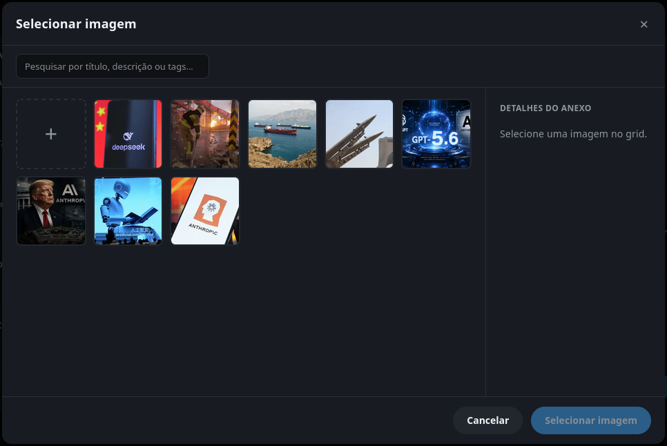
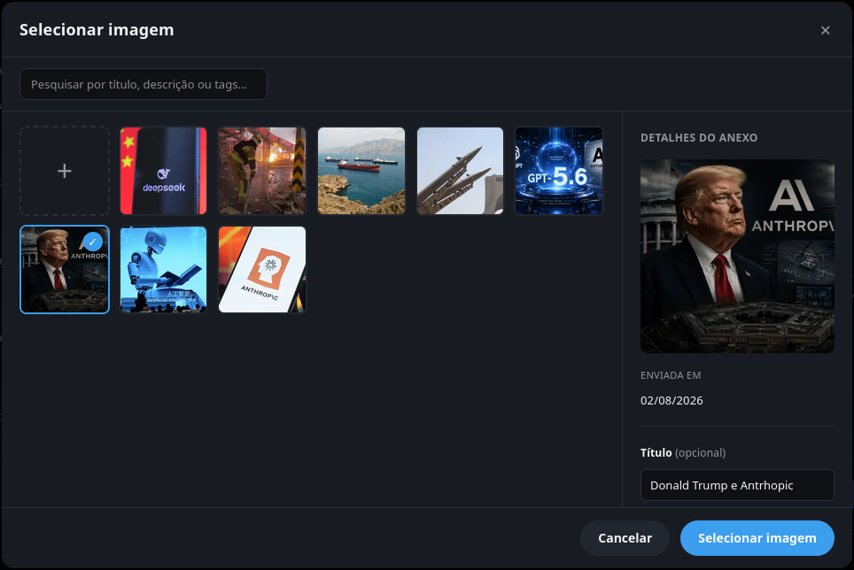
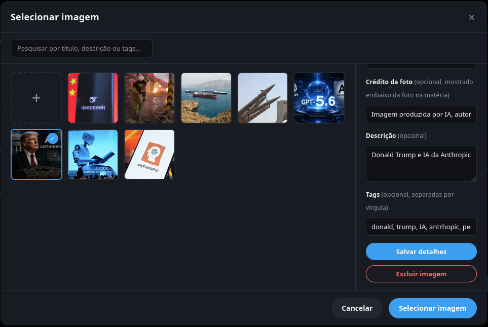

# Image Library / Seletor de Imagem para Upload

Referência visual e de arquitetura para um seletor de imagens reutilizável em formulários, com uma biblioteca central de imagens que pode ser usada por várias entidades do sistema.

Baseado na implementação do projeto JM - Jornal de Mirador (`/home/marcos/Documentos/Projects/jm-jornal-de-mirador`), usando Cloudinary como hospedeiro. O hospedeiro é só um detalhe de implementação — a ideia vale para qualquer provedor (Cloudinary, S3, R2, Bunny, etc.).

## Referências Visuais

### Grid de imagens, nenhuma selecionada



### Imagem selecionada, painel de detalhes preenchido



### Edição de metadados da imagem



## Ideia Geral

- Existe uma tabela central de imagens (ex: `images`), independente das entidades que a usam.
- Outras tabelas referenciam essa tabela por FK opcional (ex: `posts.image_id -> images.id`, `projects.cover_image_id -> images.id`), permitindo que a mesma imagem enviada uma vez seja reaproveitada em múltiplos registros.
- O upload é feito uma única vez; o arquivo em si fica hospedado em um provedor externo de imagens. O banco local guarda só a URL e os metadados, nunca o binário.
- Um modal "Selecionar imagem" concentra: busca na biblioteca, upload de novas imagens, edição de metadados e exclusão de imagens não utilizadas — reaproveitável em qualquer formulário do sistema que precise anexar uma imagem.

## Modelo de Dados Genérico

Tabela central de imagens:

```text
images
├── id                 PK
├── title              opcional
├── description        opcional (texto longo)
├── tags                opcional (texto longo; lista separada por vírgula)
├── credit              opcional (credito/autoria, exibido junto da imagem no conteudo final)
├── url                 obrigatorio (URL segura do arquivo no provedor)
├── provider_id         opcional (public id / key no provedor, usado para gerar variações e para excluir o arquivo remoto depois)
├── bytes               opcional (tamanho do arquivo)
├── width               opcional
├── height              opcional
└── registered_at       obrigatorio, default now()
```

Entidade consumidora (exemplo genérico, pode ser posts, produtos, projetos, banners etc.):

```text
{entidade}
├── ...
├── image_id            FK opcional -> images.id, ON DELETE SET NULL
```

A FK é opcional e com `ON DELETE SET NULL` como rede de segurança no banco — mas a regra de negócio real (ver abaixo) impede a exclusão de uma imagem em uso antes mesmo de chegar nesse ponto.

## Backend - Endpoints Genéricos

```text
GET    /images        lista paginada, com busca (title, description, tags, credit)
POST   /images        upload (multipart, campo "image"), aceita metadados opcionais no body
PUT    /images/:id    atualiza metadados (title, description, tags, credit)
DELETE /images/:id    remove a imagem (bloqueado se estiver em uso)
```

Regras de implementação:

- upload processado em memória (sem gravar em disco) e enviado ao provedor via stream; nunca em base64 (evita ~33% de overhead);
- upload sempre assinado no backend; nunca expor a chave secreta do provedor de imagens no frontend, nem usar preset de upload direto do navegador quando a chave for sensível;
- busca feita no banco (`contains`/`ILIKE` em title/description/tags/credit), não filtrada só no cliente, para funcionar mesmo com a biblioteca paginada;
- paginação de tamanho fixo (ex: 24 por página);
- antes de excluir, contar quantos registros de entidades consumidoras referenciam essa imagem (`count(where image_id = :id)`); se maior que zero, bloquear com erro claro tipo "Não é possível excluir: há N registro(s) usando esta imagem";
- exclusão no provedor externo é best-effort e não bloqueante: apagar a linha do banco primeiro, depois disparar a remoção do arquivo remoto sem travar a resposta da API nesse passo (um arquivo órfão no provedor é aceitável e limpável depois; travar a exclusão por causa de instabilidade de terceiro não é).

## Frontend - Comportamento do Modal

- Grid de miniaturas da biblioteca, com um botão "+" como primeiro item para upload direto (sem aba separada de upload);
- clicar em uma miniatura apenas destaca a seleção (borda + marcador) e preenche o painel de detalhes à direita — não aplica nada no formulário ainda;
- a seleção só é confirmada de fato quando o usuário clica no botão do rodapé "Selecionar imagem" (fluxo em dois passos, no estilo da media library do WordPress); "Cancelar" fecha sem aplicar nada;
- painel de detalhes (lateral direita) mostra preview, data de envio, tamanho e dimensões quando disponíveis, e campos editáveis: Título (opcional), Crédito da foto (opcional), Descrição (opcional), Tags (opcional, separadas por vírgula);
- "Salvar detalhes" atualiza os metadados da imagem selecionada sem fechar o modal;
- "Excluir imagem" pede confirmação explícita ("essa ação não pode ser desfeita") antes de chamar a exclusão; erro de "está em uso" retornado pelo backend deve aparecer para o usuário (toast/mensagem), não travar a UI;
- campo de busca no topo, com debounce (ex: 400ms), reiniciando a paginação para a página 1 a cada nova busca;
- no formulário que abre o modal, guardar em estado o objeto completo da imagem escolhida (para exibir preview/metadados sem nova requisição), mas ao salvar o formulário enviar para o backend apenas o `image_id` (a FK);
- remover a imagem do formulário (botão "x" no preview) é uma ação local — apenas desassocia a imagem daquele registro (`image_id = null` no próximo save); não exclui a imagem da biblioteca nem afeta outros registros que a usem.

## Prompt Pronto para Usar

Copie o bloco abaixo e cole no Claude Code, Codex ou outra ferramenta de IA para implementar esse padrão em um projeto novo, adaptando ao stack/framework/banco daquele projeto.

```bash
Implemente uma biblioteca de imagens reutilizavel com um modal "Selecionar imagem" para uso em formularios, seguindo o padrao de referencia abaixo:

Referencias de imagem:
- /home/marcos/Documentos/Projects/AI-Design-Reference/components/image-library/image-picker-modal-grid-empty-selection.png
- /home/marcos/Documentos/Projects/AI-Design-Reference/components/image-library/image-picker-modal-image-selected.png
- /home/marcos/Documentos/Projects/AI-Design-Reference/components/image-library/image-picker-modal-edit-metadata.png

Modelo de dados:
- Crie uma tabela central "images" (id, title opcional, description opcional, tags opcional, credit opcional, url obrigatoria, provider_id opcional, bytes/width/height opcionais, registered_at com default now()).
- Toda entidade que precisar de uma imagem referencia essa tabela por uma FK opcional (ex: image_id), com ON DELETE SET NULL.
- Uma mesma imagem pode ser usada por varios registros diferentes; nao duplicar o upload.

Backend:
- Endpoints: listar (paginado, com busca por title/description/tags/credit), criar (upload multipart processado em memoria, enviado via stream ao provedor de imagens configurado no projeto), atualizar metadados, excluir.
- Upload sempre assinado/feito pelo backend, nunca expondo chave secreta do provedor no frontend.
- Antes de excluir uma imagem, contar quantos registros a referenciam; se houver algum, bloquear a exclusao com mensagem clara informando quantos registros estao usando.
- Exclusao do arquivo no provedor externo deve ser best-effort/nao bloqueante, executada depois de remover a linha do banco.

Frontend (modal "Selecionar imagem"):
- Grid de miniaturas da biblioteca com um botao "+" como primeiro item para upload direto.
- Clicar numa miniatura apenas destaca a selecao e preenche um painel de detalhes lateral; a selecao so e aplicada ao formulario quando o usuario clicar no botao "Selecionar imagem" do rodape (fluxo em dois passos). "Cancelar" fecha sem aplicar.
- Painel de detalhes com preview, data de envio, tamanho/dimensoes quando disponiveis, e campos editaveis opcionais: Titulo, Credito da foto, Descricao, Tags (separadas por virgula), com botao "Salvar detalhes".
- Botao "Excluir imagem" com confirmacao explicita antes de excluir; exibir ao usuario o erro de "imagem em uso" retornado pelo backend quando ocorrer.
- Campo de busca com debounce (ex: 400ms) filtrando no backend, reiniciando a paginacao ao mudar o termo.
- O formulario que abre o modal deve guardar o objeto completo da imagem escolhida em estado local (para exibir preview sem nova requisicao), mas enviar ao backend apenas o id da imagem (a FK) ao salvar.
- Um botao para remover a imagem do formulario deve apenas desassociar localmente (limpar a FK), sem excluir a imagem da biblioteca.

Ao concluir, compare visualmente o resultado com as imagens de referencia antes de considerar a tarefa finalizada.
```
